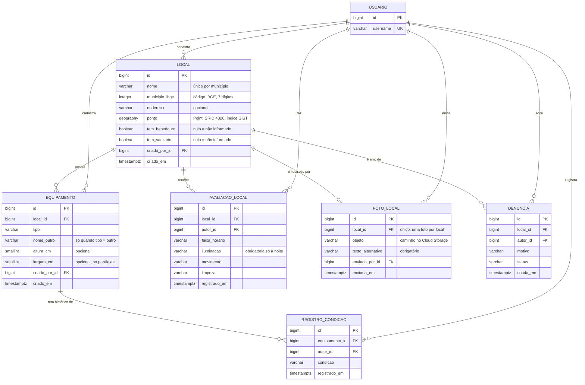

# Modelo de Dados

Modelo entidade-relacionamento da aplicação.
Cada entidade e campo aponta para a regra de negócio (RN) da [síntese da pesquisa](sintese-pesquisa.md) que o justifica. O que não vem da pesquisa está marcado como **decisão de projeto**.

> **Versão 1, de 03/10/2026.** As decisões em aberto (seção 7) foram tomadas com base na síntese da pesquisa.

---

## 1. Diagrama

---

## 2. Entidades

### Usuario

Já existe (app `usuarios`). Entra no modelo como **autor** de todo registro: a RN-08 pede autoria visível no lugar de fila de aprovação.

### Local

Lugar público com equipamentos, identificado pelo nome que os praticantes usam.

| Campo | Tipo | Origem |
|---|---|---|
| `nome` | texto, até 120 | RN-01: locais são reconhecidos por nome próprio |
| `municipio_ibge` | inteiro, código IBGE de 7 dígitos | RN-09: a cidade é atributo, não constante do código |
| `endereco` | texto, opcional | RN-10: descrição legível para a lista textual |
| `ponto` | `PointField(geography=True)` | RN-06: busca por raio é a consulta principal |
| `tem_bebedouro`, `tem_sanitario` | booleano, nulo = não informado | RN-07: presença de comodidade |
| `criado_por`, `criado_em` | FK Usuario, data | RN-08: autoria visível |

Sobre `municipio_ibge`: Araraquara é `3503208`. Os dois primeiros dígitos identificam a UF (`35` = SP), por isso a UF não tem campo próprio. Os municípios atendidos ficam numa lista de opções no código (`IntegerChoices`), que dá o nome a ser exibido. No MVP a lista tem só Araraquara; atender outra cidade é acrescentar uma linha, sem refatoração (RN-09).

### Equipamento

Peça de treino dentro de um local. Duas barras fixas de alturas diferentes são dois equipamentos.

| Campo | Tipo | Origem |
|---|---|---|
| `local` | FK Local | RN-01: equipamento pertence a um local |
| `tipo` | escolha fixa | README, seção 3 |
| `nome_outro` | texto curto | Obrigatório só quando `tipo = outro` |
| `altura_cm` | inteiro, opcional | RN-03: barra australiana baixa (E04), altura da barra fixa |
| `largura_cm` | inteiro, opcional | RN-03: paralelas largas demais (E03) |
| `criado_por`, `criado_em` | FK Usuario, data | RN-08 |

Valores de `tipo`: `barra_fixa`, `barras_paralelas`, `espaldar`, `barra_australiana`, `outro`.

Dimensões são opcionais porque nem todo colaborador terá trena. A lista de dimensões é provisória até a medição em campo (síntese, seção 10).

### RegistroCondicao

Observação datada do estado de um equipamento. A condição exibida é a do registro mais recente, com a data visível.

| Campo | Tipo | Origem |
|---|---|---|
| `equipamento` | FK Equipamento | RN-02 |
| `autor` | FK Usuario | RN-02, RN-08 |
| `condicao` | escolha fixa | RN-02 |
| `registrado_em` | data e hora | RN-02 |

Escala proposta, a partir das palavras usadas nas entrevistas:

| Valor | Significado | Fala de origem |
|---|---|---|
| `bom` | Uso sem restrição | "bom estado de conservação" (E05) |
| `desgastado` | Funciona, precisa de pintura ou acabamento | "bom; falta pintura e acabamento" (E04) |
| `precario` | Uso possível, com cuidado | "condição precária" (E01, E02, E03, E06) |
| `quebrado` | Não dá para usar | Equipamento quebrado sem reparo (E06) |

### AvaliacaoLocal

Relato estruturado de uma visita: segurança no horário da visita e zeladoria do espaço. Sem texto livre.

| Campo | Tipo | Origem |
|---|---|---|
| `local` | FK Local | RN-04 |
| `autor` | FK Usuario | RN-08 |
| `faixa_horario` | `manha`, `tarde`, `noite` | RN-04; faixas da síntese, seção 10 |
| `iluminacao` | `boa`, `fraca`, `ausente` | RN-05: "iluminação é boa" (E01) |
| `movimento` | `movimentado`, `pouco_movimento`, `vazio` | RN-05: "sempre tem gente por perto" (E01), "quando há movimento" (E02) |
| `limpeza` | `limpo`, `regular`, `sujo` | RN-07: lixo e folhas secas (E05), zeladoria (E06) |
| `registrado_em` | data e hora | RN-02, por analogia: o dado envelhece |

`iluminacao` só é obrigatória na faixa `noite`: de dia ela não informa nada sobre segurança.

### FotoLocal

Uma foto por local (README, seção 3). O arquivo vai direto ao Cloud Storage por signed URL; o banco guarda só o caminho.

| Campo | Tipo | Origem |
|---|---|---|
| `local` | FK única para Local | Uma foto por local |
| `objeto` | texto | Caminho do arquivo no bucket |
| `texto_alternativo` | texto, obrigatório e não vazio | CLAUDE.md, WCAG 2.2 |
| `enviada_por`, `enviada_em` | FK Usuario, data | RN-08 |

**Implementação adiada** para a etapa de nuvem: depende de bucket e signed URL.

### Denuncia

Mecanismo de correção sem fila de aprovação prévia (RN-08). A análise é feita no admin do Django (README, decisão 01).

| Campo | Tipo | Origem |
|---|---|---|
| `local` | FK Local | RN-08 |
| `autor` | FK Usuario | RN-08 |
| `motivo` | escolha fixa | RN-08; campos estruturados (seção 8 da síntese) |
| `status` | `aberta`, `procedente`, `improcedente` | Decisão de projeto |
| `criada_em` | data e hora | Decisão de projeto |

Valores de `motivo`: `local_inexistente`, `local_duplicado`, `equipamento_incorreto`, `avaliacao_incorreta`, `foto_inadequada`.

---

## 3. Restrições garantidas pelo banco

Regras simples o bastante para virar `CONSTRAINT` no PostgreSQL. Valem mesmo para dado inserido fora da aplicação.

| Restrição | Origem |
|---|---|
| `Local`: nome único por município, sem diferenciar maiúsculas | RN-01 |
| `Equipamento`: `nome_outro` preenchido se e somente se `tipo = outro` | Decisão de projeto |
| `Equipamento`: `largura_cm` só em `barras_paralelas` | RN-03 |
| `Equipamento`: dimensões maiores que zero | Decisão de projeto |
| `AvaliacaoLocal`: `iluminacao` obrigatória quando `faixa_horario = noite` | RN-05 |
| `FotoLocal`: `texto_alternativo` não vazio | CLAUDE.md |

---

## 4. Regras da camada de serviço

Regras que dependem de consulta ou de critério ajustável. Ficam fora de models e views (CLAUDE.md, Arquitetura).

| Regra | Origem |
|---|---|
| Condição atual de um equipamento = registro mais recente | RN-02 |
| Aviso de possível duplicata: local com nome parecido a poucos metros de outro | RN-01 |
| Busca por raio a partir de um ponto, com filtros por tipo de equipamento, dimensão e faixa de horário | RN-03, RN-04, RN-06 |
| Resumo de segurança por faixa de horário, a partir das avaliações recentes | RN-04 |

---

## 5. Decisões técnicas

| Decisão | Motivo |
|---|---|
| `ponto` como `geography` (SRID 4326) | Distância em metros em qualquer lugar do planeta. Uma projeção local (UTM 22S) fixaria a região, contra a RN-09. |
| Índice GiST em `ponto` | Criado pelo GeoDjango por padrão. Sustenta a busca por raio (RN-06, README decisão 02). |
| Município pelo código IBGE | Identificador oficial, sem ambiguidade de grafia. A UF sai dos dois primeiros dígitos. |
| Escalas como `TextChoices` | Valores fixos e legíveis direto no banco, sem tabela auxiliar nem join. |
| Datas com fuso (`timestamptz`) | `USE_TZ = True`: grava em UTC e exibe em `America/Sao_Paulo`. |

---

## 6. Fora do modelo

| Item | Motivo |
|---|---|
| Proximidade de serviço de saúde | Indício de um participante (E06). Síntese, seção 8. |
| Limpeza do sanitário | Um participante (E02). `limpeza` cobre o espaço como um todo (RN-07). |
| Comentário em texto livre | Ninguém pediu (síntese, seção 8). Risco de estigma em segurança (RN-05). |
| Tabela de municípios | O código IBGE com a lista de municípios atendidos basta para o MVP (D3). |

---

## 7. Decisões tomadas

| # | Questão | Decisão | Motivo |
|---|---|---|---|
| D1 | Escala de condição do equipamento | Quatro níveis: `bom`, `desgastado`, `precario`, `quebrado` | Cobre as quatro situações relatadas e separa a manutenção leve (E04) do estado precário |
| D2 | Segurança e zeladoria juntas ou separadas | Juntas em `AvaliacaoLocal` | Um relato por visita: menos formulários, uma tabela |
| D3 | Representação do município | Código IBGE (`municipio_ibge`) | Identificador oficial, sem ambiguidade de grafia |
| D4 | Alvo da denúncia | Só `Local`, com o motivo indicando a parte afetada | Uma FK simples; a moderação abre o local no admin |
